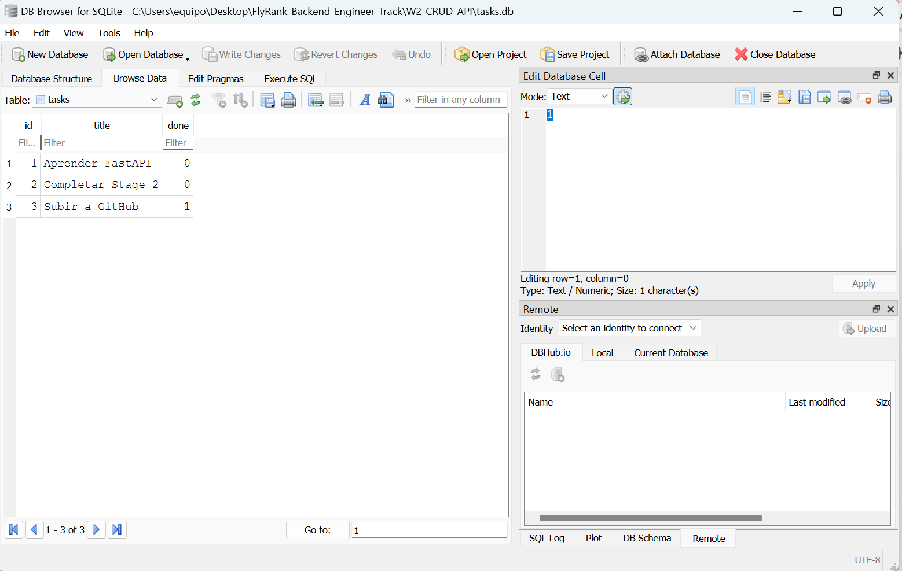
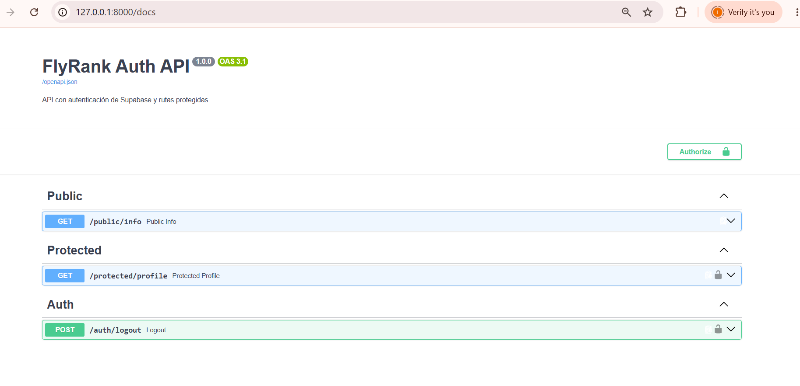

# \# W2-CRUD-API

# 

# API para la gestión de tareas con FastAPI.

# 

# \## Instalación y Ejecución

# 1\. Activa tu entorno virtual: `source venv/Scripts/activate`

# 2\. Ejecuta la API: `uvicorn main:app --reload`

# 

# \## Endpoints

# | Método | Ruta | Descripción |

# | :--- | :--- | :--- |

# | POST | /tasks | Crear una nueva tarea |

# | GET | /tasks | Listar tareas |

# | PUT | /tasks/{task\_id} | Actualizar una tarea |

# | DELETE | /tasks/{task\_id} | Eliminar una tarea |

# 

# \## uso (curl)

# `curl -i http://127.0.0.1:8000/tasks`

# 

## API de gestión de tareas construida con **FastAPI** y migrada a una base de datos relacional persistente utilizando **SQLite**

Se eligió SQLite para este proyecto por las siguientes razones
**Archivo único y cero configuración:** No requiere instalar ni configurar un servidor de base de datos externo (como PostgreSQL o MySQL); todo vive en un único archivo local (`tasks.db`)
**Persistencia real:** A diferencia de las estructuras en memoria, los datos se almacenan en disco, lo que garantiza que la información sobreviva a los reinicios del servidor.
- **Ideal para desarrollo y APIs ligeras:** Ofrece consultas rápidas, soporte SQL estándar y transacciones nativas con un consumo mínimo de recursos.


## Requisitos Previos y Configuración
1. Tener instalado **Python 3.10+**.
2. Clonar el repositorio y entrar en la carpeta del proyecto.

---

## Instrucciones de Inicio Rápido

Sigue estos comandos en tu terminal para poner a correr la aplicación de forma local:

1. **Crear y activar el entorno virtual:**
   ```bash
   python -m venv .venv
   source .venv/Scripts/activate  # En Windows (Git Bash / PowerShell)
2. **Instalar dependencias** pip install fastapi uvicorn
3. **Iniciar el servidor de desarrollo con Uvicorn:** uvicorn main:app --reload
La API quedará corriendo en http://127.0.0.1:8000 y la documentación interactiva (Swagger UI) está disponible en http://127.0.0.1:8000/docs. El archivo de base de datos tasks.db y su tabla de tareas se generan automáticamente en el primer inicio junto con 3 tareas de ejemplo iniciales

se ejecutaron consultas directas sobre la base de datos
SELECT * FROM tasks WHERE done = 1;
se muestra una captura de la tabla tasks abierta mediante DB Browser for SQLite.



---

## 📌 Documentación de Endpoints

La API cuenta con los siguientes endpoints configurados y documentados en Swagger UI:

| Método | Ruta | Descripción | Autenticación |
| :--- | :--- | :--- | :--- |
| **POST** | `/auth/signup` | Registra un nuevo usuario en Supabase Auth | Pública 🔓 |
| **POST** | `/auth/login` | Inicia sesión y retorna el Token de Acceso | Pública 🔓 |
| **POST** | `/auth/logout` | Cierra la sesión activa del usuario | Protegida 🔒 (Bearer Token) |
| **GET** | `/public/info` | Endpoint de prueba libre de autenticación | Pública 🔓 |
| **GET** | `/protected/profile` | Retorna el perfil del usuario autenticado | Protegida 🔒 (Bearer Token) |

---
**Instalar dependencias** pip install fastapi uvicorn supabase python-dotenv pydantic
**Configurar las variables de entorno:**
Crea un archivo .env en la raíz del proyecto basándote en el archivo .env.example e incluye tus credenciales de Supabase:
**SUPABASE_URL=tu_url_de_supabase**
**SUPABASE_KEY=tu_key_anon_de_supabase**
Ejecutar el servidor de desarrollo:

Bash uvicorn main:app --reload
http://127.0.0.1:8000/docs
